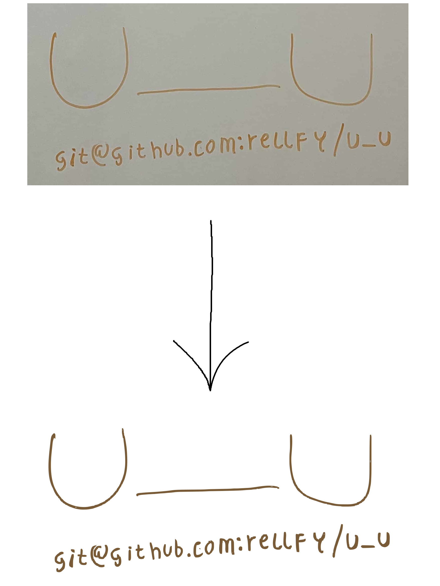

# u_u

**Convert diagram pictures into SVGs**



## What is this?
This is a tool that allows converting a JPEG photo, e.g. a diagram photo,
into an SVG picture, as seen in the example abvove.

## How do I use it?
As seen in [examples/main.rs](./examples/main.rs):
```rs
use u_u::jpeg_to_svg;

const JPEG_BYTES: &[u8] = include_bytes!("./u_u.jpg");

fn main() {
    let svg_bytes = jpeg_to_svg(JPEG_BYTES).unwrap();
    std::fs::write("./output_example.svg", svg_bytes).unwrap();
}
```

### How does it work?
The algorithm interprets each RGB pixel as a 3D vector.

The first step is to calculate the background colour, which is calculated as
the average colour of all the pixels in the image -- this means that the
background of the photo (such as the white of a whiteboard, or black of a
blackboard) must be more than 50% of the photo, or this fails (it could be
an optional argument to pass the background colour if it is known to
prevent failure on those cases).

Then, there are two passes on the image to filter out the background:

1. The first pass tries to identify what is part of the foreground, and removes
the background parts according to a threshold value.
This results in a new image.
2. The second pass tries to identify what is part of the background, and removes
the foreground parts according to a threshold value.
This results in a new image.
3. The images from 1. and 2. are merged.
All second pass pixels (background) are removed from the foreground.
Non-second-pass pixels that are similar to the foreground colour, and
different to the background colour, are added to the foreground if not already
in the foreground -- this reduces errors from first pass.
This cleans the foreground of any background that wasn't removed in the first pass.
4. Pixels with a low neighbour count (i.e, surrounded by many transparent
pixels) are removed. This further removes noise from the picture.
5. The resulting RBG bytes are converted to SVG using [vtracer][0].

[0]: https://github.com/visioncortex/vtracer
